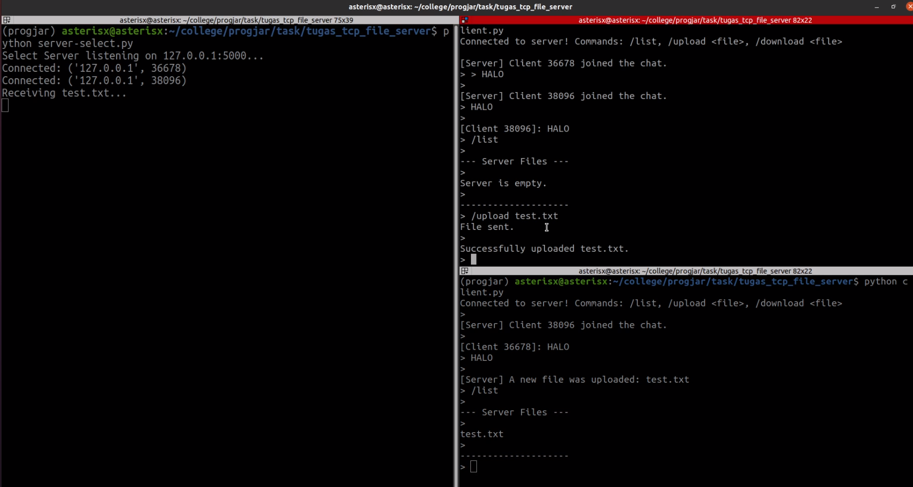
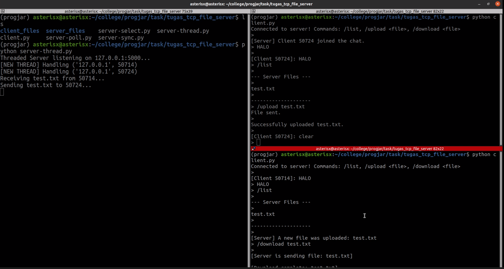

[](https://classroom.github.com/a/mRmkZGKe)
# Network Programming - Assignment G01

## Anggota Kelompok
| Nama              | NRP        | Kelas     |
| ---               | ---        | ----------|
| Jason Kumarkono   | 5025241105 |     C     |

## Link Youtube (Unlisted)
```
https://youtu.be/YQPyiVVtfyk
```

---

## Penjelasan Program


Pada tugas ini saya membangun **TCP File Server** berbasis terminal yang mendukung banyak client secara bersamaan. Fitur utamanya meliputi **broadcast pesan** ke semua client yang terhubung, serta tiga command utama: `/list`, `/upload <filename>`, dan `/download <filename>`.

Saya mengimplementasikan **empat versi server** dengan pendekatan concurrency yang berbeda-beda, plus **satu client universal** yang bisa dipakai untuk semua server:

| File | Pendekatan |
|---|---|
| `server-sync.py` | Synchronous (satu client saja) |
| `server-select.py` | I/O Multiplexing dengan `select()` |
| `server-poll.py` | I/O Multiplexing dengan `poll()` |
| `server-thread.py` | Concurrency dengan `threading` |
| `client.py` | Client universal untuk semua server |

---

### Konsep Dasar: Framing

Karena TCP itu pada dasarnya cuma **byte stream yang kontinu** — dia nggak punya konsep "pesan" atau "file" yang terpisah — saya harus bikin sendiri aturan supaya receiver tahu di mana satu pesan berakhir dan pesan berikutnya dimulai. Teknik ini disebut **Framing**.

Di project ini, saya pakai dua jenis framing:

**1. Delimiter Framing (untuk command & chat)**

Setiap command atau pesan chat diakhiri dengan karakter newline (`\n`). Receiver membaca byte satu per satu sampai ketemu `\n`, baru dianggap satu pesan utuh.

```python
buf = b""
while b"\n" not in buf:
    chunk = sock.recv(1)
    if not chunk: break
    buf += chunk
```

**2. Chunked Blocks dengan Length Prefix (untuk transfer file)**

Untuk kirim file secara binary, saya pakai teknik **chunked blocks**. Setiap potongan file (chunk 4096 byte) di-prefix dengan header 4-byte yang berisi panjang chunk tersebut. Kalau panjangnya `0`, artinya file sudah selesai dikirim (sentinel value).

```python
# Sender: kirim tiap chunk dengan header panjangnya
chunk = f.read(4096)
sock.sendall(struct.pack(">I", len(chunk)) + chunk)

# Terakhir, kirim sentinel (panjang 0) sebagai tanda selesai
sock.sendall(struct.pack(">I", 0))
```

```python
# Receiver: baca header dulu, lalu baca data sebanyak yang ditulis di header
header = sock.recv(4)
length = struct.unpack(">I", header)[0]
if length == 0:
    break  # file sudah selesai
```

Format `">I"` artinya big-endian unsigned 32-bit integer. Ini memastikan kedua sisi (sender dan receiver) membaca angka dalam urutan byte yang sama.

---

### 1. `client.py` — Client Universal

Client punya tantangan unik: dia harus bisa **mengetik command** (yang butuh `input()` blocking) sekaligus **mendengarkan pesan** dari server (yang butuh `recv()` blocking) secara bersamaan.

**Solusinya:** Client di-split jadi dua task menggunakan `threading`:

- **Main thread** → menangani input user (ketik command, kirim ke server)
- **Background thread (`listen_to_server`)** → terus-menerus mendengarkan pesan dari server

Background thread ini juga yang menangani proses download. Ketika server mengirim header `FILE_READY <filename>`, thread ini otomatis switch ke mode baca binary chunks dan menyimpan file ke folder `client_files/`.

```
┌─────────────────────────────────────────────┐
│                  client.py                  │
├──────────────────┬──────────────────────────┤
│   Main Thread    │   Background Thread      │
│                  │   (listen_to_server)     │
│  input() → kirim │  recv() → tampilkan      │
│  command ke      │  pesan chat / broadcast  │
│  server          │  atau download file      │
│                  │  otomatis kalau dapat    │
│                  │  "FILE_READY"            │
└──────────────────┴──────────────────────────┘
```

**Command yang tersedia:**
- `/list` — lihat daftar file di server
- `/upload <filename>` — upload file dari `client_files/` ke server
- `/download <filename>` — download file dari server ke `client_files/`
- Ketik apa saja selain command di atas → dikirim sebagai pesan chat (broadcast)

---

### 2. `server-sync.py` — Server Synchronous

Ini adalah server paling sederhana. Dia cuma bisa melayani **satu client dalam satu waktu**.

**Cara kerjanya:**
1. Server memanggil `accept()` dan menunggu client pertama connect.
2. Begitu ada client, server masuk ke loop yang dedicated hanya untuk client itu.
3. Selama server sibuk dengan client pertama, **semua client lain harus antri** — mereka tersambung tapi diabaikan total sampai client pertama disconnect.

**Kenapa blocking?** Karena fungsi `recv()` memblokir seluruh program sampai ada data masuk. Satu `recv()` yang nunggu = seluruh server freeze.

```
Client 1 connect → Server: "Oke, aku fokus ke kamu."
Client 2 connect → Server: "..." (diabaikan, masuk antrian)
Client 1 disconnect → Server: "Oh, ada yang antri!" → baru proses Client 2
```

Karena server ini cuma menangani satu client, fitur broadcast nggak bisa diimplementasikan di sini. Pesan chat hanya di-echo balik ke pengirim.

---

### 3. `server-select.py` — Server dengan `select()`

Server ini menyelesaikan masalah blocking dengan teknik **I/O Multiplexing** menggunakan modul `select`.

**Cara kerjanya:**
1. Server menyimpan **daftar semua socket** yang aktif (termasuk server socket sendiri) di dalam list `inputs`.
2. List ini diberikan ke fungsi `select.select()`.
3. OS akan memantau semua socket itu dan **hanya mengembalikan socket yang siap dibaca**.
4. Server tinggal loop melalui socket-socket yang ready aja, proses datanya, lalu balik lagi ke monitoring.

```python
read_ready, _, _ = select.select(inputs, [], [])

for sock in read_ready:
    if sock == server_socket:
        # Ada client baru mau connect → accept()
    else:
        # Client lama kirim data → recv() dan proses
```

**Kelebihan:**
- Bisa handle banyak client sekaligus dalam **satu thread**
- Portable — jalan di Linux maupun Windows

**Kekurangan:**
- Punya **batas maksimal file descriptor** yang bisa dipantau (biasanya 1024)
- Setiap pemanggilan `select()`, OS harus scan **seluruh** daftar socket → performa O(n)

Di server ini, **broadcast** sudah bisa jalan. Setiap pesan chat dari satu client langsung diteruskan ke semua client lain.

---

### 4. `server-poll.py` — Server dengan `poll()`

Server ini juga pakai **I/O Multiplexing**, tapi memakai `poll()` sebagai pengganti `select()`.

**Perbedaan utama dengan select:**
- `poll()` bekerja langsung dengan **file descriptor** (integer), bukan objek socket Python.
- Karena itu, saya butuh dictionary `fd_map` untuk mapping: `fd (int) → socket object`.
- `poll()` **tidak punya batas tetap** jumlah file descriptor yang bisa dipantau (tidak ada ceiling 1024 seperti select).

```python
poll_obj = select.poll()
poll_obj.register(server_socket.fileno(), select.POLLIN)

fd_map = {server_socket.fileno(): server_socket}
```

**Apa itu file descriptor?** File descriptor itu semacam "nomor antrian" yang dikasih OS ke setiap resource yang dibuka program saya (file, socket, keyboard, dll). Karena `poll()` adalah system call level OS, dia kerja pakai nomor integer ini, bukan objek Python.

`poll()` juga mengembalikan **event type** yang lebih detail:
- `POLLIN` → ada data siap dibaca
- `POLLHUP` → client terputus
- `POLLERR` → ada error di socket

**Kelebihan dibanding select:**
- Tidak ada batas tetap jumlah fd
- Sedikit lebih efisien untuk jumlah client yang banyak

**Kekurangan:**
- Hanya tersedia di **UNIX/Linux** (tidak support Windows)
- Masih O(n) — kernel tetap scan linear semua fd yang terdaftar

---

### 5. `server-thread.py` — Server dengan Threading

Server ini mengambil pendekatan yang berbeda: bukan multiplexing, tapi **concurrency** dengan membuat thread terpisah untuk setiap client.

**Cara kerjanya:**
1. **Main thread** hanya melakukan satu hal: loop `accept()` menunggu client baru.
2. Begitu ada client connect, main thread langsung **spawn thread baru** (`client_handler`) yang dedicated untuk client itu.
3. Main thread langsung balik ke `accept()` — tidak pernah blocking.

```python
client_thread = threading.Thread(target=client_handler, args=(client_sock, client_addr))
client_thread.daemon = True
client_thread.start()
```

Setiap thread menjalankan fungsi `client_handler()` yang berisi loop baca command, proses, dan kirim respons — persis seperti server-sync, tapi sekarang **setiap client punya thread sendiri**.

```
Main Thread: accept() → spawn Thread 1 → accept() → spawn Thread 2 → ...
Thread 1: handle Client A (baca command, kirim respons, dst.)
Thread 2: handle Client B (baca command, kirim respons, dst.)
```

Karena semua thread berbagi memori yang sama, saya bisa pakai list global `active_clients` untuk broadcast.

**Kelebihan:**
- Kode lebih mudah dipahami (setiap client = satu fungsi handler yang jalan sendiri)
- Cross-platform (jalan di Linux dan Windows)

**Kekurangan:**
- Setiap thread butuh resource memori → kalau ada ribuan client, bisa boros memory
- Akses ke shared state (`active_clients`) bisa menyebabkan race condition kalau tidak hati-hati

---

## Screenshot Hasil



